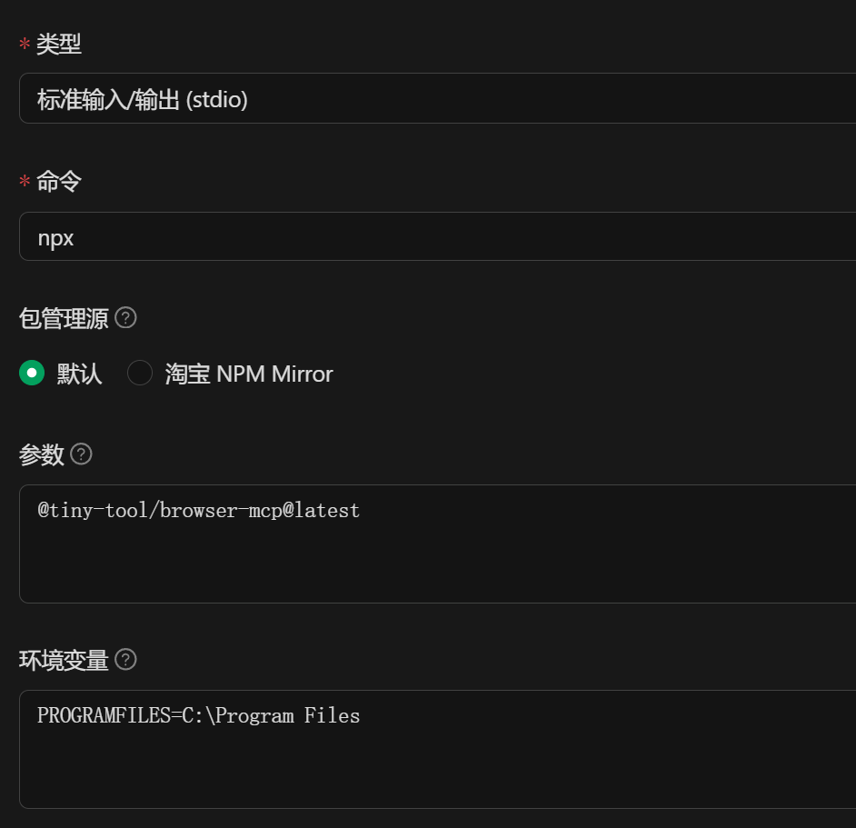
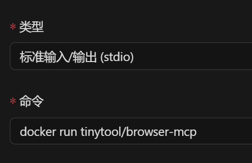
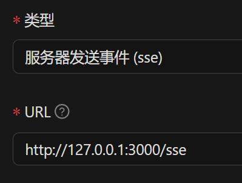

# tiny-tool-browser

## 项目简介

tiny-tool-browser 是一个用于网页内容抓取和搜索引擎内容提取的工具集，支持通过 API、本地 MCP 协议和 Dify 插件三种方式集成。适用于 AI Agent、自动化数据采集等场景。

通过提取搜索结果的具体内容，屏蔽广告内容，将 HTML 转化为 Markdown，移除页面中的不可见元素，减少输出的 token 量，为 12~14b 的小模型提供可用的搜索结果。

## 主要功能

- 支持通过本地浏览器（Puppeteer）抓取网页内容
- 支持百度、搜狗微信等主流搜索引擎内容提取
- 提供 RESTful API 服务
- 提供 MCP 协议服务，便于与 AI/Agent 系统集成
- 提供 Dify 插件，支持 Dify 平台调用

## 安装与运行

### 与 Chat 工具一起使用

> [!IMPORTANT]
> 推荐提前在电脑中安装 chrome 浏览器

```shell
# 默认使用 stdio 输出
npx @tiny-tool/browser-mcp@latest
# 如果需要 sse 运行在 3000 端口，则可以使用
# npx @tiny-tool/browser-mcp@latest -t sse -p 3000
```

推荐设置环境变量

```
PROGRAMFILES=C:\Program Files
PUPPETEER_SKIP_DOWNLOAD=true
```

如果电脑中没有安装 chrome，则不要设置 `PUPPETEER_SKIP_DOWNLOAD=true`

Cherry Studio 的配置参考


### 使用 docker 运行

#### stdio 模式下与 Chat App 集成

```shell
docker run tinytool/browser-mcp
```

Cherry Studio 的配置参考


#### sse/streamable 模式下与 Chat App 集成

如果需要将 MCPServer 运行在服务器上以 http 服务的形式使用，可以参考下面的配置

```shell
# 在服务器上执行
docker run -d -p 3000:3000 --name browser-mcp tinytool/browser-mcp -t sse
```

Cherry Studio 的配置参考


如果是 streamable 模式，则使用命令

```shell
docker run -d -p 3000:3000 --name browser-mcp tinytool/browser-mcp -t streamable
```

并将链接中的 /sse 改成 /mcp

### Dify 插件(WIP)

开发中，推荐使用 MCP 集成

## 目录结构

- `packages/browser`：核心网页抓取与搜索服务（Node.js/Express）
- `packages/mcp`：MCP 协议服务，封装搜索与网页内容提取工具
- `dify-plugin`：Dify 平台插件，基于 Python
- `docker`：容器化部署相关文件

## 主要依赖

- `express`: Web framework
- `puppeteer-core`: Headless Chrome/Chromium automation
- `@ghostery/adblocker-puppeteer`: Ad blocking for Puppeteer
- `jsdom`: JavaScript-based HTML parser
- `unified` / `rehype` / `remark`: Ecosystem for processing content with plugins (Markdown, HTML)
- `zod` / `zod-to-json-schema`: Schema declaration and validation
- `@modelcontextprotocol/sdk`: SDK for Model Context Protocol
- `better-sqlite3` / `knex`: Database interaction (SQLite)
- `dify_plugin`: Base library for Dify platform plugins
- `yargs`: Command-line argument parsing

## 贡献

欢迎 issue 和 PR，建议先提 issue 讨论。

## 许可证

MIT
